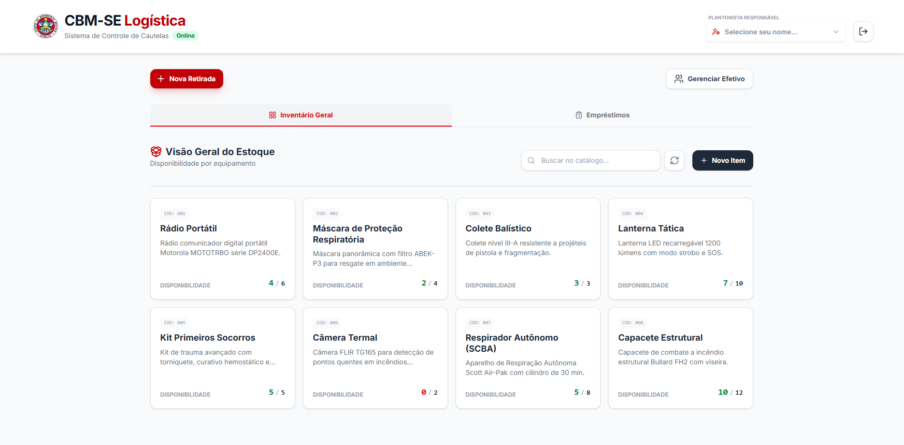
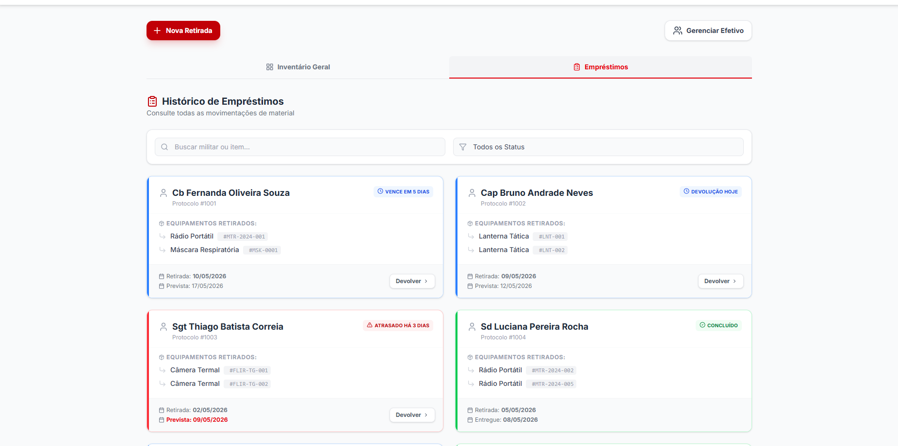

# Sistema de Cautelas - CBMSE

<p align="center">
  
  
</p>

Este projeto é uma aplicação web desenvolvida para gerenciar o empréstimo de materiais e equipamentos entre bombeiros do Corpo de Bombeiros Militar de Sergipe (CBMSE). Ele serve como uma ferramenta centralizada para registrar empréstimos de materiais, acompanhar prazos de devolução, gerenciar o inventário de equipamentos e controlar protocolos de vistoria. O sistema foi projetado para substituir processos manuais, reduzindo erros e melhorando a eficiência na gestão de recursos.

O projeto foi desenvolvido com as seguintes tecnologias:

* Vue 3 com TypeScript
* Supabase para banco de dados
* TailwindCSS para estilização
* Vercel para deploy


## 🚀 Funcionalidades

- **Autenticação**: Login seguro com credenciais institucionais.
- **Cautelas**: Registro, acompanhamento e histórico de empréstimos de materiais.
- **Material**: Gestão completa do inventário de equipamentos.
- **Protocolos**: Controle de protocolos de vistoria e segurança.

## 🛠️ Instalação

### Pré-requisitos
- Node.js >= 18.x
- npm

### 1. Clonar o repositório
```bash
git clone <url-do-repositorio>
cd sistema_cautelas
```

### 2. Instalar dependências
```bash
npm install
```

### 3. Configurar variáveis de ambiente
Crie um arquivo `.env` na raiz do projeto com as seguintes variáveis:

```env
# Exemplo de variáveis (ajustar conforme necessidade)
BACKEND_URL=http://localhost:3000/api
VITE_API_BASE_URL=http://localhost:3000/api
```

### 4. Executar em modo de desenvolvimento
```bash
npm run dev
```
A aplicação estará disponível em `http://localhost:5173`.

### 5. Build para produção
```bash
npm run build
```
Os arquivos de produção serão gerados na pasta `dist`.

## 🧪 Testes

```bash
# Executar testes
npm run test
```

## 📝 Sobre o Projeto

Projeto desenvolvido por [Artur Alencar](https://github.com/arturalencar) para o 1º Grupamento de Bombeiros Militar de Sergipe durante o período de estágio na instituição no ano de 2025. 